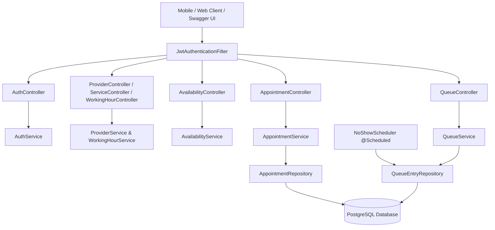
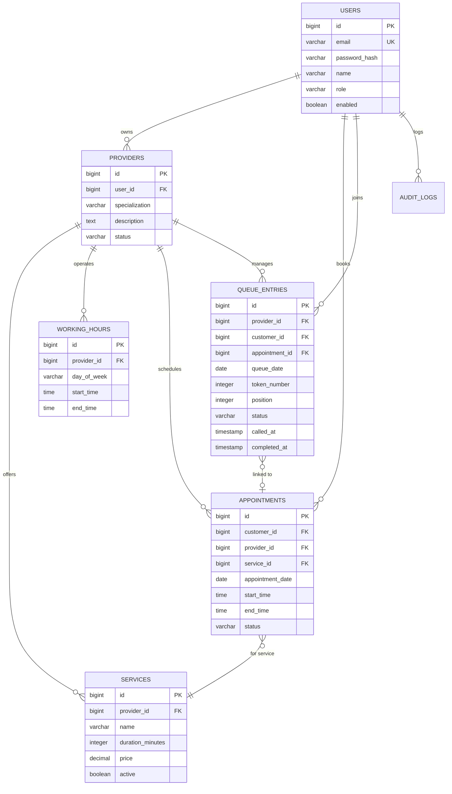

# QueueLess - Intelligent Virtual Queue & Appointment Engine

QueueLess is a high-concurrency Spring Boot REST backend for remote queue token management, slot availability calculation, double-booking prevention, and service provider scheduling.

## Architectural Overview



## Entity Relationship (ER) Diagram



## Default Seed Accounts

When launched locally, `DataInitializer` pre-populates the database with demo accounts:

| Role | Email | Password | Details |
| --- | --- | --- | --- |
| **ADMIN** | `admin@queueless.com` | `AdminPassword123` | Platform Administrator |
| **PROVIDER** | `sarah@clinic.com` | `DoctorPassword123` | Dr. Sarah Connor (Dental Care) |
| **PROVIDER** | `evans@clinic.com` | `DoctorPassword123` | Dr. James Evans (Cardiology) |
| **CUSTOMER** | `alice@example.com` | `CustomerPassword123` | Customer User |
| **CUSTOMER** | `bob@example.com` | `CustomerPassword123` | Customer User |

## Interactive API Documentation

Run the application and navigate to:
- **Swagger UI**: `http://localhost:8080/swagger-ui.html`
- **Health Check**: `http://localhost:8080/api/health`

## Build & Test Commands

```bash
# Run unit, controller, and concurrency test suites
mvn clean test

# Run application locally
mvn spring-boot:run
```
